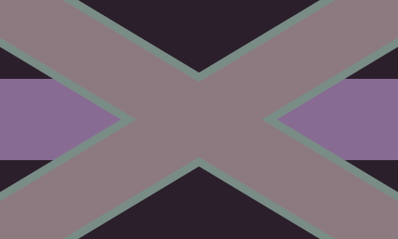
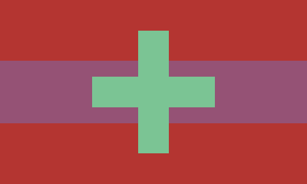
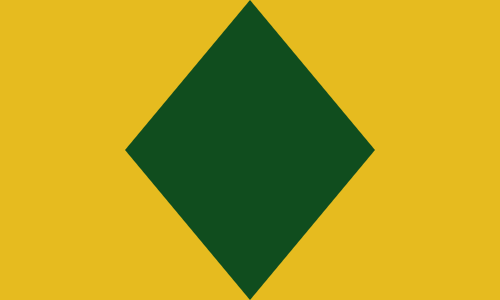

# Carwin's Generators

This is a site for hosting various generators I come up with.

Currently, the site only hosts my flag generator, but there are others. For now,
I hope fans of vexillology, worldbuilders, dungeon masters, etc... will enjoy.

You can visit the generator site here: https://carwin.github.io/generators

## Flag Generator

The flag generator operates using my [flag-generator](https://github.com/carwin/flag-generator)
project, which is also published as an npm package in the GitHub registry.

The basic premise for the generator is that it is a _pseudo_-random generator for
flags. All operations during generation are based on a value called the seed.
What this means, is, given the same seed, the generator will always return the
same flag.

At the generators site, I've allowed a few controls:

### seed string

The seed string is any string you can remember. When given a seed string, a seed
is generated and given to the flag for production, this is a simple way to get
back to a flag you've generated in the past.

This is useful if you've got a place or person you'd like to generate a flag for.

The flag above, at the time of this writing, was generated with the string "The
Kingdom of Rugrior," which was a neat sounding fake kingdom I came up with.

### seed

The seed itself is exposed and you can change it as you want. Setting the value
above `0.9` will crash things, so be aware. HTML5 number field validation is
picky, and I haven't come up with a nice way to keep things valid yet.

### ratio

Most flags fall into a general range of height/width ratios. In the `flag-generator`
package, there's a method to generate random ratios in a fibonnaci sequence
which is nice, and most flag ratios around the world seem to fall into the sequence.

In the generator, you can get as wild as you want with the ratio.

Common ratios are: `1:1`, `1:2`, `2:3`, `3:5` etc...

### IMPORTANT

**Updates to the generator or the generator site are likely to break the save functionality
and change any existing seeds. A seed or seed string that provided one flag may, after
an update, provide a completely different flag.**

## Issues

Surely you'll find an issue somewhere. When you do, try to note whether the issue
is with the generator site or with the _generator_ itself.

If the issue is with the generator (e.g., the flag is only displaying black, the
Fusil division fills up 99% of the flag, etc...), please file an issue at that
generator's project page. Otherwise, if the issue is with the website (e.g.: broken
routes, field inputs crashing the page, and so on) file the issue with this project.

## Generator Issue Links

 - Flag Generator: https://github.com/carwin/flag-generator/issues
